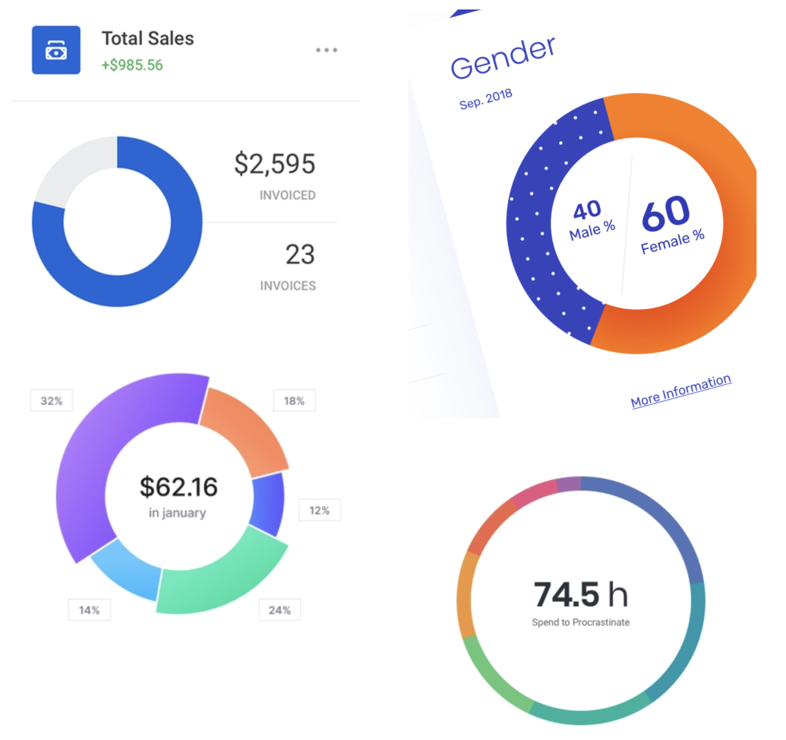

# Custom View

### Задание. Реализовать кастом View - график Pie Chart, на котором будем визуализировать траты по категориям:

1. Обязательно реализуйте метод onMeasure и учтите все возможные MeasureSpecs
2. Реализуйте механизм сохранения состояния внутри View
3. Предусмотрите как минимум 10 категорий(цветов) на графике
4. В качестве данных для визуализации используйте файл `payload.json`
5. Реализуйте механизм обработки клика на сектор - по клику на часть графика должен срабатывать коллбек, в качестве аргумента - категория на которой был клик евент.

Примеры дизайна которыми можно вдохновляться:

### Результат работы:
- сделайте Pull-Request
- приложите скриншоты к Pull-Request'у
