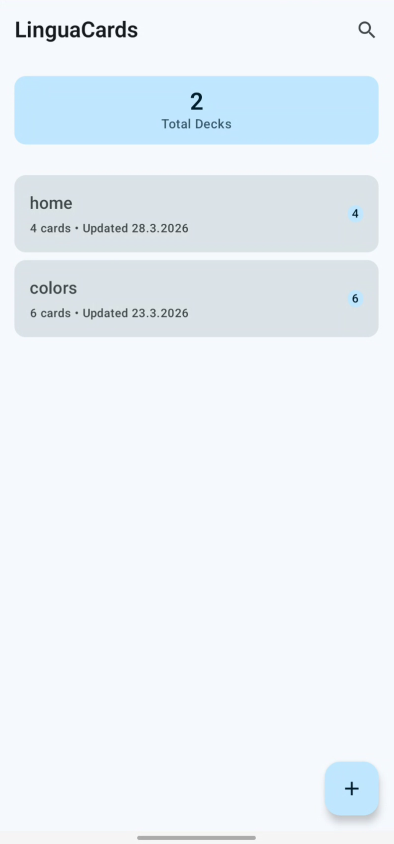
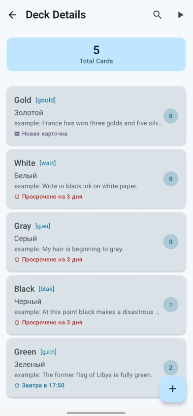
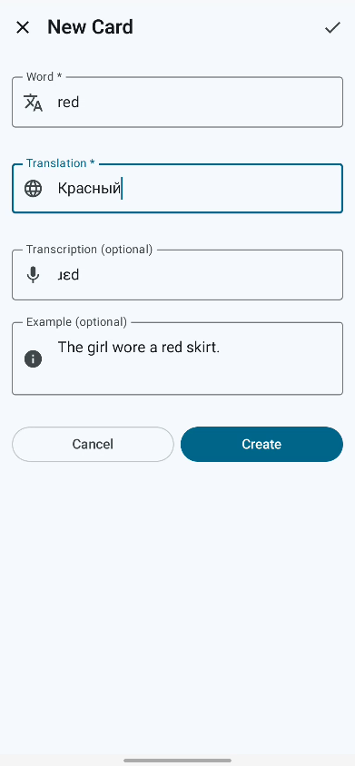
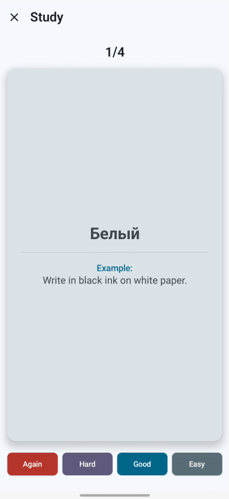

# Проектная работа: Приложение для изучения английских слов

### Цель

Сдать и защитить проект

### Задание

1. Проект должен быть реализован по Single Activity Application паттерну, то есть в приложении
   должна использоваться только одна активити, а остальные экраны реализуются через фрагменты или
   Compose.
2. Навигацию можно организовать с использованием библиотеки Navigation Component или другой
   популярной библиотеки.
3. Для презентационного слоя используйте архитектуру MVVM/MVI. Если будете использовать MVI, можете
   сделать самописный вариант или взять популярную библиотеку (при использовании сторонней
   библиотеки согласуйте это предварительно с руководителем курса).
4. Сделайте разбивку на слои. Слоистая или Чистая архитектура — выбирайте сами.
5. Желательно использовать Jetpack Compose, а не фрагменты, но это не обязательно.
6. Приложение должно быть многомодульным — декомпозируйте фичи по модулям.
7. Обязательно используйте DI для организации архитектуры. Желательно Dagger2 или Hilt; можно
   использовать Koin, если будете делать KMP-проект.
8. Для асинхронных операций используйте Kotlin Coroutines.
9. Для сетевого взаимодействия используйте Retrofit/Ktor. Для сериализации/десериализации JSON —
   Gson, Moshi или Kotlin Serialization.
10. Вы можете сделать проект с поддержкой KMP. Это будет плюсом, но не обязательно.
11. Покройте unit тестами 5 классов. Обязательно должна быть покрыта ViewModel (или её аналог, если
    используете MVI). Напишите UI тесты для одного пользовательского сценария.

### Описание проекта

1. Игровой режим изучения. Слова отображаются в виде карт. Передняя часть карты – слово с
   транскрипцией, оборотная – перевод и пример использования. Переворот по тапу с анимацией. Кнопки
   для классификации сложности слова.
2. Алгоритм SM-2 который на основе сложности слов будет выставлять периоды повторений.
3. CRUD для колод.
4. CRUD для карт.
5. Транскрипция и примеры использования слов при создании карт должны подтягиваться автоматически с
   внешнего API.






**Технологии:**

- Clean Architecture. MVVM для презентационного слоя
- Navigation Component
- Jetpack Compose
- DI – Dagger2 и Hilt
- Kotlin Coroutines
- Retrofit и Kotlin Serialization
- Room

**Диаграмма зависимостей:**

```mermaid
          ┌─────────────────┐
          │     :app        │
          │    (сборка)     │
          └────────┬────────┘
                   │
         ┌─────────┼─────────┐
         │                   │
         ▼                   ▼
┌────────────────┐  ┌────────────────┐
│ :features:*    │  │ :core:data     │
│ (UI слои)      │  │ (реализации)   │
└───────┬────────┘  └───────┬────────┘
        │                   │
        │                   ▼
        │          ┌────────────────┐
        │          │ :core:database │
        │          │ :core:network  │
        │          └───────┬────────┘
        │                  │
        ▼                  ▼
┌─────────────────────────────────────┐
│          :core:domain               │
│    (интерфейсы и бизнес-логика)     │
└─────────────────────────────────────┘
                   │
                   ▼
┌─────────────────────────────────────┐
│          :core:model                │
│      (общие модели данных)          │
└─────────────────────────────────────┘
