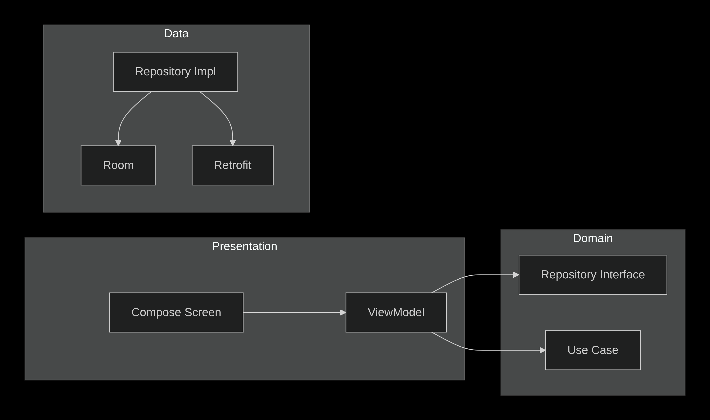

# Проектная работа: Приложение для изучения английских слов

### Цель

Сдать и защитить проект

### Задание

- Проект должен быть реализован по Single Activity Application паттерну, то есть в приложении
  должна использоваться только одна активити, а остальные экраны реализуются через фрагменты или
  Compose.
- Навигацию можно организовать с использованием библиотеки Navigation Component или другой
  популярной библиотеки.
- Для презентационного слоя используйте архитектуру MVVM/MVI. Если будете использовать MVI, можете
  сделать самописный вариант или взять популярную библиотеку (при использовании сторонней
  библиотеки согласуйте это предварительно с руководителем курса).
- Сделайте разбивку на слои. Слоистая или Чистая архитектура — выбирайте сами.
- Желательно использовать Jetpack Compose, а не фрагменты, но это не обязательно.
- Приложение должно быть многомодульным — декомпозируйте фичи по модулям.
- Обязательно используйте DI для организации архитектуры. Желательно Dagger2 или Hilt; можно
  использовать Koin, если будете делать KMP-проект.
- Для асинхронных операций используйте Kotlin Coroutines.
- Для сетевого взаимодействия используйте Retrofit/Ktor. Для сериализации/десериализации JSON —
  Gson, Moshi или Kotlin Serialization.
- Вы можете сделать проект с поддержкой KMP. Это будет плюсом, но не обязательно.
- Покройте unit тестами 5 классов. Обязательно должна быть покрыта ViewModel (или её аналог, если
  используете MVI). Напишите UI тесты для одного пользовательского сценария.
- Подключите к проекту статический анализатор Detekt.

### LinguaCards

LinguaCards – Android-приложение для изучения английских слов с использованием алгоритма
интервальных повторений. Позволяет создавать колоды карточек, отслеживать прогресс и
повторять слова в оптимальные моменты.

### Возможности

- Создание и управление колодами карточек
- Добавление, редактирование и удаление карточек (слово, перевод, транскрипция, пример
  использования)
- Автоматический подбор транскрипции и примера через Free Dictionary API
- Режим изучения с переворотом карточки и выбором оценки (Не знаю / Сложно / Нормально / Легко)
- Отслеживание даты следующего повторения на основе алгоритма SM-2
- Поиск по колодам и карточкам
- Тёмная / светлая тема с поддержкой динамических цветов (Android 12+)
- Полная поддержка русского и английского языков интерфейса


### Технологии:

- Язык – Kotlin
- UI – Jetpack Compose (Material 3)
- Навигация – Compose Navigation
- DI – Dagger Hilt
- База данных – Room (SQLite)
- Сеть – Retrofit + OkHttp, сериализация kotlinx.serialization (JSON)
- Асинхронность – Kotlin Coroutines + Flow
- Архитектура – Clean Architecture (слои: presentation, domain, data) + MVVM (StateFlow)
- Тестирование
    - Unit-тесты: JUnit, Turbine, MockK
    - UI-тесты: Kaspresso, Compose Test
- Статический анализ – Detekt + кастомные правила (ComposeModifierMissingRule,
  NoMutableStateWithoutRememberRule)
- Сборка – Gradle Kotlin DSL, version catalogs

### Структура проекта

```mermaid
LinguaCards/
├── app/                        Главный модуль приложения
├── core/                       Базовые модули
│   ├── model/                  Модели данных (Deck, Card, SrsGrade)
│   ├── domain/                 Use cases и репозитории (интерфейсы)
│   ├── data/                   Реализация репозиториев
│   ├── database/               Room (сущности, DAO)
│   └── network/                Retrofit-клиент, DTO, мапперы
├── features/                   Фичи (экраны)
│   ├── decklist/               Список колод
│   ├── deckdetail/             Детали колоды + список карточек
│   ├── cardedit/               Создание / редактирование карточки
│   ├── study/                  Режим изучения
│   └── about/                  Экран "О приложении"
└── detekt-rules/               Кастомные правила Detekt
```

### Диаграмма зависимостей:

```mermaid
          ┌─────────────────┐
          │     :app        │
          │    (сборка)     │
          └────────┬────────┘
                   │
         ┌─────────┼─────────┐
         │                   │
         ▼                   ▼
┌────────────────┐  ┌────────────────┐
│ :features:*    │  │ :core:data     │
│ (UI слои)      │  │ (реализации)   │
└───────┬────────┘  └───────┬────────┘
        │                   │
        │                   ▼
        │          ┌────────────────┐
        │          │ :core:database │
        │          │ :core:network  │
        │          └───────┬────────┘
        │                  │
        ▼                  ▼
┌─────────────────────────────────────┐
│          :core:domain               │
│    (интерфейсы и бизнес-логика)     │
└─────────────────────────────────────┘
                   │
                   ▼
┌─────────────────────────────────────┐
│          :core:model                │
│      (общие модели данных)          │
└─────────────────────────────────────┘
```

### Архитектура



- Presentation – Compose UI + ViewModel (Hilt). Управляет состоянием через StateFlow.
- Domain – Независимые сущности (Deck, Card), интерфейсы репозиториев и бизнес-логика.
- Data – Реализация репозиториев, работа с Room (сущности, DAO) и сетью (Retrofit, DTO, мапперы).

### Сборка и запуск

**Требования:**
- Android Studio Panda (2025.3.2) или новее
- JDK 21
- Android SDK (minSdk 24, compileSdk 36)

**Шаги:**
- git clone https://github.com/roman-akbashev/2025-08-otus-android-akbashev.git
- cd 2025-08-otus-android-akbashev/hw-17-lingua-cards
- Откройте проект в Android Studio.
- Дождитесь синхронизации Gradle.
- Подключите физическое устройство или запустите эмулятор.
- Нажмите Run (зелёная стрелка) или выполните команду:
  - ./gradlew installDebug

### Тестирование

**Unit-тесты:**
Запуск всех unit-тестов (модули core, features):
- ./gradlew test

Запуск тестов конкретного модуля, например core/domain:
- ./gradlew :core:domain:test

**UI-тесты :**
- ./gradlew connectedAndroidTest

### Статический анализ (Detekt)

**Проект настроен на использование Detekt с кастомными правилами (модуль detekt-rules):**
- ComposeModifierMissingRule – требует указания параметра modifier у Composable-функций (кроме Preview).
- NoMutableStateWithoutRememberRule – запрещает использование mutableStateOf без обёртки в remember внутри Composable-функций.

**Запуск проверки:**
- ./gradlew detekt
- ./gradlew build

Конфигурация находится в config/detekt/detekt.yml.

###  Лицензия
MIT License. Подробнее в файле LICENSE 

###  Контакты
Разработчик: Роман Акбашев
Email: roman-akbashev@mail.ru